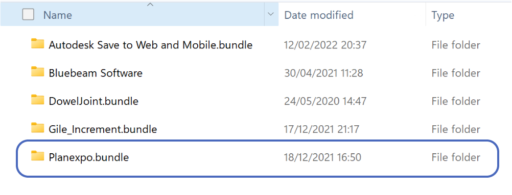
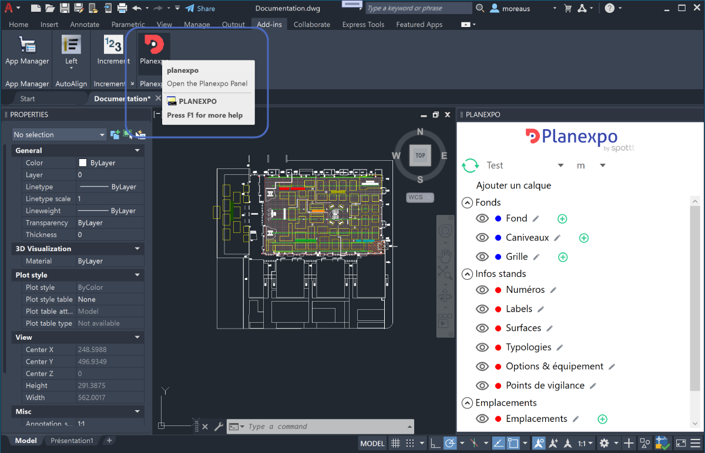
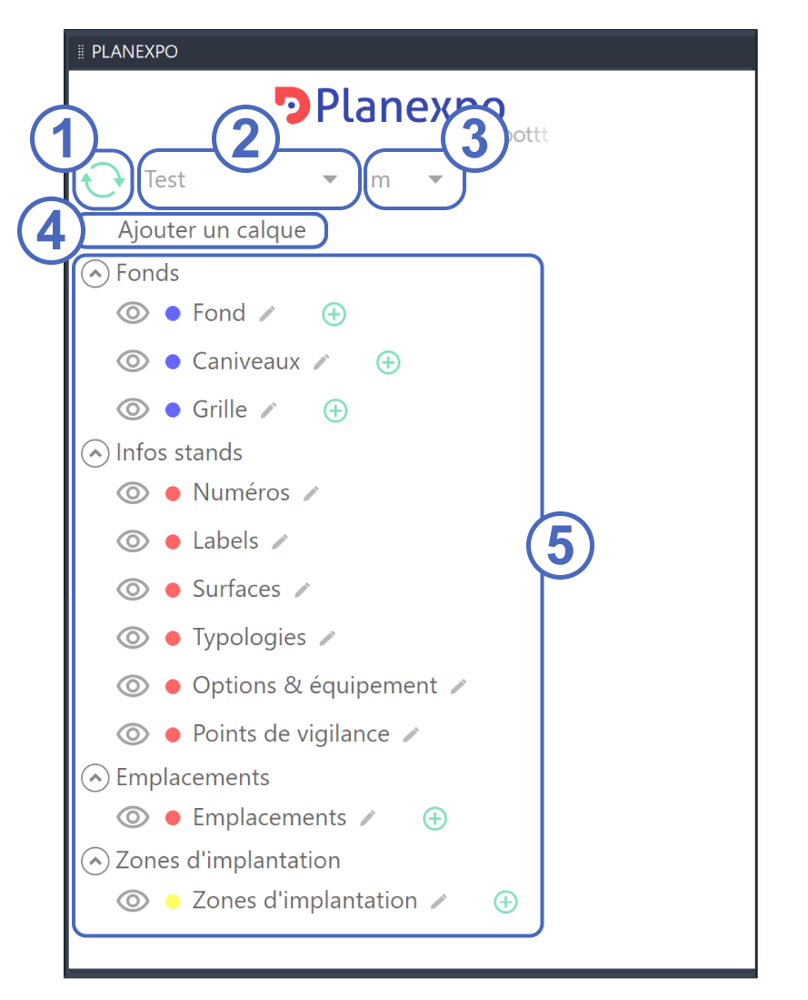
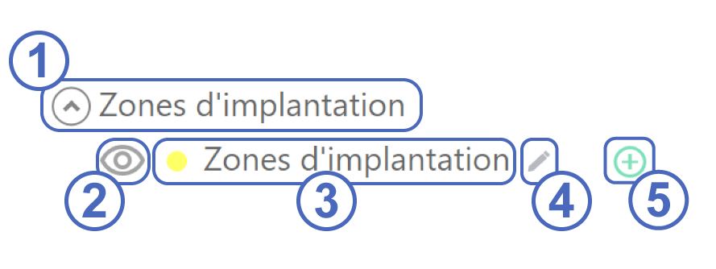
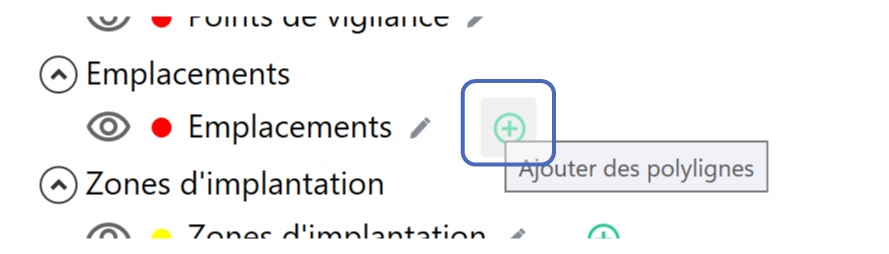
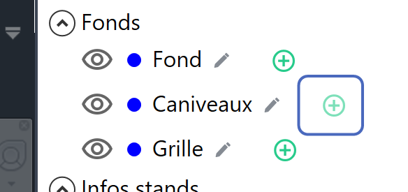

## Planexpo dans Autocad

### Utilisation du plugin

[TOC]

## Généralités

### Installation

L’installation du plugin s’effectue en dézippant le contenu de l’archive “PlanexpoAutoCAD.zip” dans le dossier suivant :

C:\Users\{nom de l’utilisateur}\AppData\Roaming\Autodesk\ApplicationPlugins

### Démarrage

Après avoir ouvert un fichier Autocad, cliquez sur le bouton “Planexpo” dans l’onglet “Add-ins” pour ouvrir le panneau Planexpo :

### Interface

Le panneau Planexpo contient plusieurs éléments :

1. Rafraîchir : Synchronise les polylignes d’Autocad avec les emplacements de Planexpo
2. Sélection de l’espace : Sélectionne l’espace de travail à afficher dans Autocad
3. Echelle : Sélectionne l’échelle de dessin dans Autocad (m, cm ou mm)
4. Ajouter un calque : Ajoute un nouveau calque de fond dans Planexpo
5. Liste des calques : Affiche la liste des calques Planexpo

A chaque calque “Planexpo” correspond un calque Autocad préfixé “PLX_”.

Chaque calque présent dans Planexpo est ensuite affiché dans la liste des calques :

1. Groupe de calque
2. Afficher ou masquer le calque
3. Nom et couleur du calque
4. Editer le nom du calque
5. Ajouter des polylignes au calque

## Gestion des emplacements

### Ajouter un emplacement

Pour ajouter un nouvel emplacement de stand, cliquez sur le bouton “Ajouter des polylignes” associé au calque “Emplacement” :

Sélectionner ensuite la ou les polylignes qui représentent les emplacements à ajouter. Les polylignes changent alors de calques pour venir se placer sur le calque “PLX_Emplacement”.

### Dessiner une polyligne

Il est également possible de dessiner des polylignes directement sur le calque “PLX_Emplacement”. Ces polylignes sont alors immédiatement ajoutées comme de nouveaux emplacements dans Planexpo.

Seules les polylignes seront ajoutées en tant qu’emplacement dans Planexpo. Les autres éléments de dessin (blocs, lignes simples, textes, dimensions, …) ne seront pas transformés en emplacement.

### Rafraichir

En cliquant sur le bouton "Rafraîchir", tous les emplacements présents dans Planexpo seront ajoutés dans Autocad. 

Tous les éléments de dessin (blocs, lignes simples, textes, dimensions, …) présents sur les calques “PLX_Emplacements” et “PLX_Zones d'implantation” seront supprimés.

## Gestion des fonds de plan

### Ajouter un fond de plan

Pour ajouter un nouveau fond de plan, créer un calque pour contenir ce fond, puis cliquez sur le bouton “Ajouter des polylignes” associé au calque de fond :

Sélectionner ensuite la ou les éléments Autocad à ajouter au fond. Ces éléments peuvent être des  lignes, des arcs, des polylignes ou du texte (simple et multiligne). En revanche, les blocs ne sont pas supportés. Pour utiliser un bloc au sein d’un fond, il est nécessaire de l’exploser avant de l’ajouter au calque du fond.
